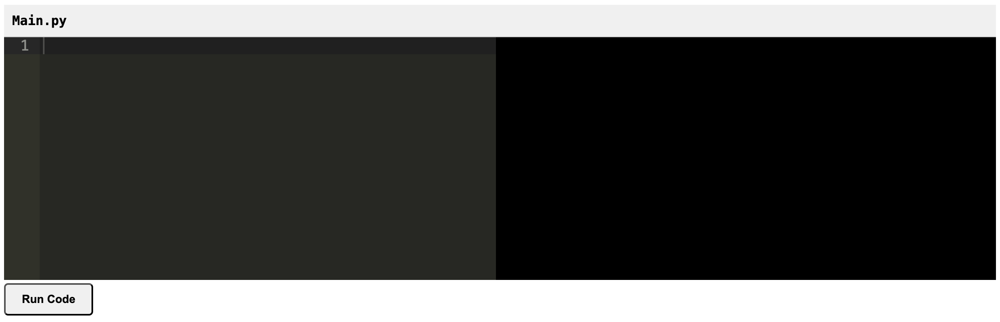

# code-editor-flask
Code editor written in HTML and CSS using FLask

## Overview
Here's an overview of the components we'll need:

- Frontend: HTML, CSS, and JavaScript with Ace editor
- Backend: Flask server to handle code execution
- AJAX to communicate between frontend and backend

## Setup
Git clone current repo on your local
```bash
git clone https://github.com/KevinJudith/code-editor-flask.git
```
Move to code-editor-flask repository
`cd path/to/code-editor-flask`

Launch python virtual environment
```bash
python3 -m menv myenv
```
Launch application
```bash
python app.py
```
You should see something like 
``` Serving Flask app 'app'
 * Debug mode: on
WARNING: This is a development server. Do not use it in a production deployment. Use a production WSGI server instead.
 * Running on http://127.0.0.1:5000
Press CTRL+C to quit
 * Restarting with watchdog (fsevents)
 * Debugger is active!
 * Debugger PIN: 841-362-026
   ```


